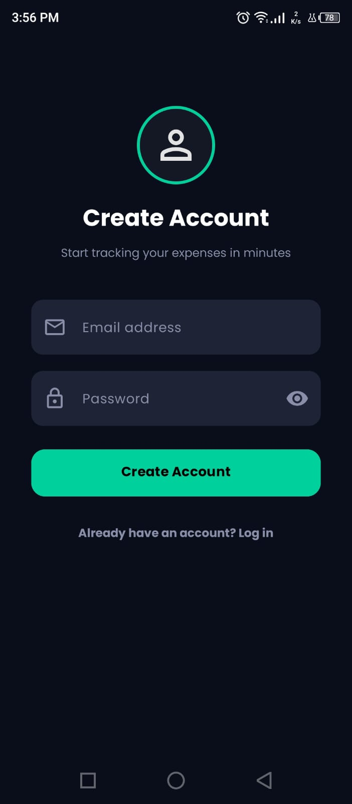
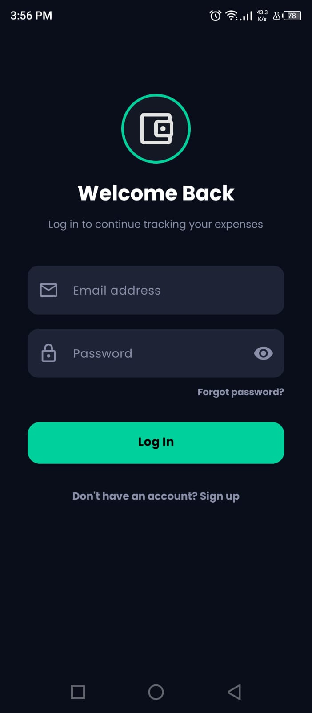
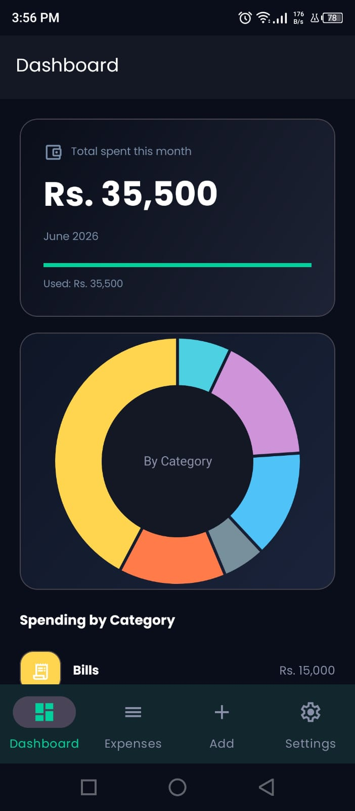
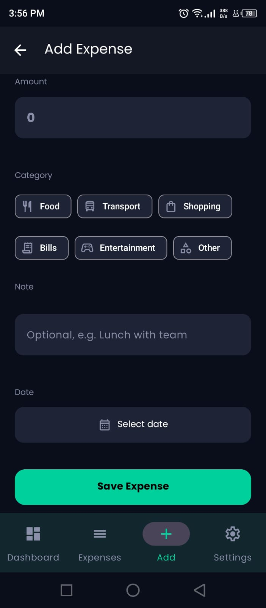
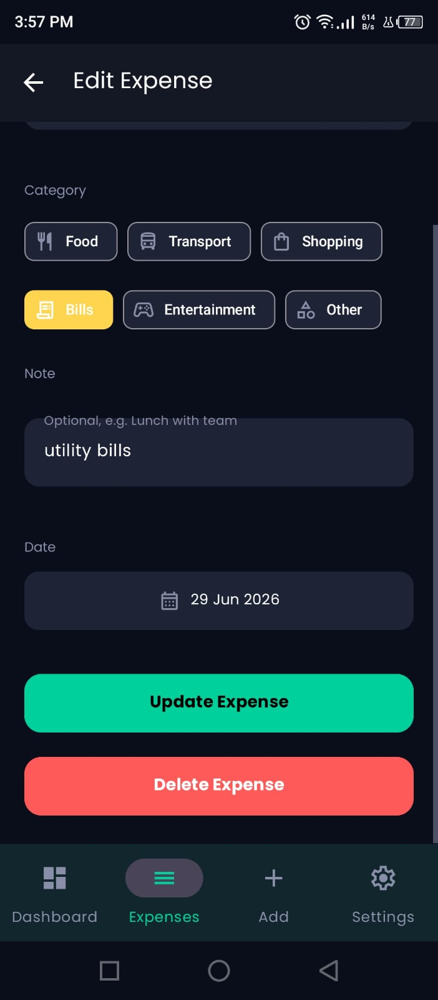
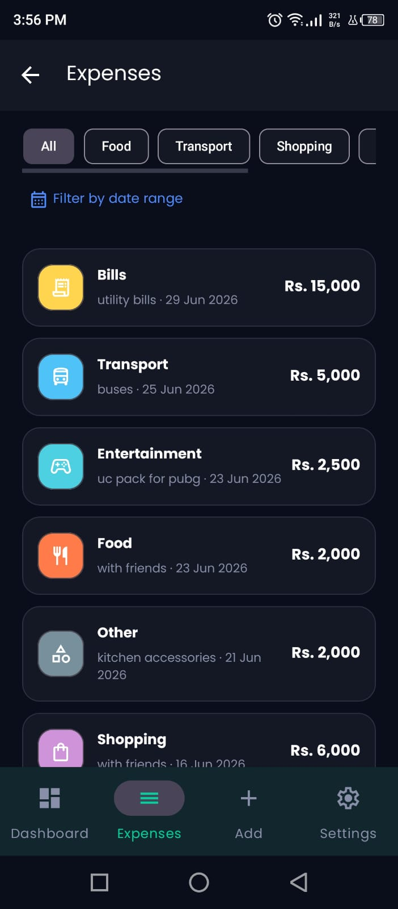
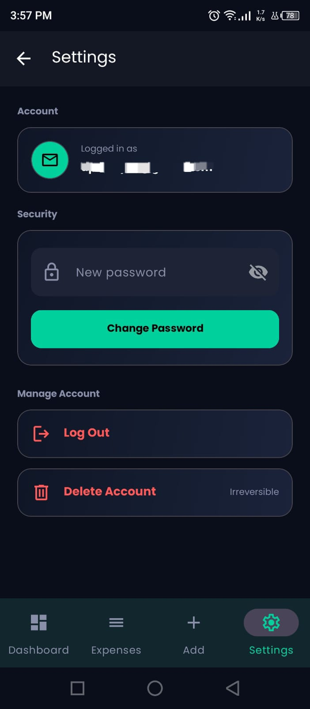

# Expense Tracker

A native Android app for tracking daily expenses by category, built with Firebase Authentication and Cloud Firestore for real-time data persistence.

---

## Features

- **Authentication** — Email/password sign up and login with mandatory email verification before access is granted
- **Dashboard** — Current month's total spending with an animated counter and a category breakdown pie chart
- **Add Expense** — Amount, category (Food, Transport, Shopping, Bills, Entertainment, Other), optional note, and date, with full input validation
- **Expense List** — Filterable by category and date range, with swipe-to-delete
- **Edit / Delete** — Update or remove any expense, with confirmation before deleting
- **Settings** — View logged-in account email, change password, resend email verification, log out, delete account
- **Offline support** — Expenses save locally and sync automatically when connectivity returns (Firestore offline persistence)

---

## Tech Stack

| Layer | Choice |
|-------|--------|
| Platform | Android (native, Java) |
| Authentication | Firebase Authentication (email/password) |
| Database | Cloud Firestore |
| Charts | MPAndroidChart (PieChart) |
| Navigation | Android Navigation Component (single Activity + Fragments) |
| UI | Material Components (Material 3 theming) |

---

## Setup

### Prerequisites
- Android Studio (latest stable)
- A Firebase project with **Authentication** (Email/Password provider enabled) and **Cloud Firestore** turned on

### Steps

1. Clone this repository.
2. In the [Firebase Console](https://console.firebase.google.com), create a project (or use an existing one).
3. Add an Android app to the Firebase project using package name `com.mad.expensetracker`.
4. Download the generated `google-services.json` and place it in the app module directory:

```
app/google-services.json
```

5. In Firebase Console, enable:
   - **Authentication → Sign-in method → Email/Password**
   - **Firestore Database** (start in production or test mode as preferred)

6. Open the project in Android Studio and let Gradle sync.
7. Build and run on a device or emulator (**Build → Make Project**, then **Run**).

---

## Project Structure

```
app/src/main/java/com/mad/expensetracker/
├── ExpenseApp.java               # Application class, initializes Firebase
├── data/
│   ├── model/Expense.java        # Expense data model
│   └── repository/
│       ├── AuthRepository.java       # Firebase Auth operations
│       └── ExpenseRepository.java    # Firestore CRUD operations
├── ui/
│   ├── auth/                     # Login, Signup
│   ├── dashboard/                # Dashboard + chart
│   ├── expense/                  # Add, Edit, List, Adapter
│   ├── settings/                 # Settings screen
│   └── MainActivity.java         # Hosts bottom navigation + nav graph
└── utils/
    └── Validators.java           # Shared input validation & formatting
```

---

## Screenshots

| | |
|---|---|
| **Sign Up** | **Login** |
|  |  |
| **Dashboard** | **Add Expense** |
|  |  |
| **Edit Expense** | **Expense List** |
|  |  |
| **Settings** | |
|  | |

---

## APK Download

[](https://github.com/dev-toobakalam/Expense-Tracker/raw/main/Expense-Tracker.apk)

**Direct Link:** [Expense-Tracker.apk](https://github.com/dev-toobakalam/Expense-Tracker/raw/main/Expense-Tracker.apk)

---

## Assumptions & Notes

- **Currency display:** Amounts are shown as whole numbers (e.g. "Rs. 26,000") rather than with decimal places, matching how everyday expenses are conventionally tracked and discussed in Pakistan.
- **Email verification is mandatory.** A user cannot reach the Dashboard until their email is verified, including on subsequent logins.
- **Forgot Password shows a neutral confirmation** regardless of whether the email is actually registered, matching Firebase's own privacy protections.
- **Login with incorrect credentials** offers both "Forgot Password" and "Sign Up Instead" rather than guessing which applies.
- **Offline saves are allowed and queued**, not blocked. Firestore's offline persistence caches writes locally and syncs once connectivity returns.

---

Built with ❤️ using Android, Firebase, and Material Design.
